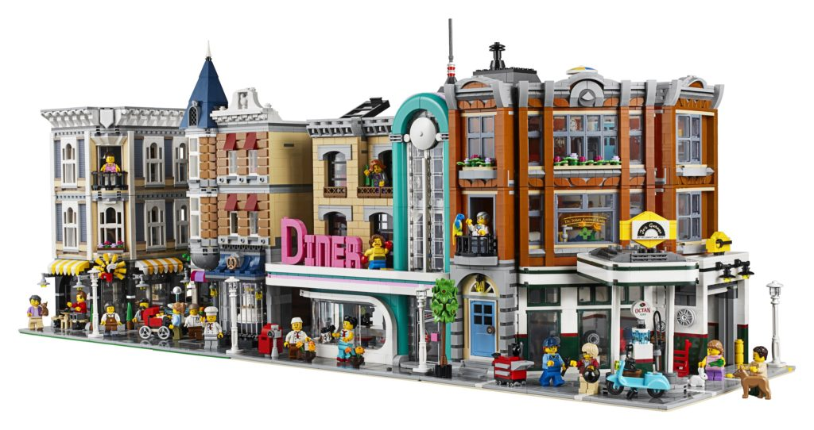

# brickworld

A browser based procedurally generated world where your brick creations come alive. The world is populated by minifigs going about their daily lives. You can follow a minifig to see where they work, play, eat, and live.

[www.brickworld.fun](https://www.jasonrowland.com/brickworld)

This is an attempt to make a world composed of building bricks, playable in a browser. Users can share their creations easily. Users can share objects like furniture, vehicles, etc through instruction books. Users can share sections of their world that other users can then import into their own world.

A shared playground where users can create their own models, worlds, and adventures for other users to explore.  Users can create it just for themselves, share it with friends, or share it with the world.

- Solo - A user is in complete control of their world. There are no constraints. They can build any model, part, plugin, econonmy they wish and deploy in their own world.

- Shared - A user can create a shared world with their friends.

- Public

  - Runs in the browser for zero friction playing
  - Each user can create their own worlds and connect their worlds with their friends
  - Users can create a shared world with their friends
  - Users can choose models
  - Users can select plugins (ai, models, game rules, parts)
  - Users can link to other worlds as if they were their own
  - Safe experience for kids to play

## [Authoring](docs/dev/authoring.md)

How to author parts

## [Blockchain](docs/dev/blockchain.md)
Blockchain ideas

* Monorepo: https://medium.com/@NiGhTTraX/how-to-set-up-a-typescript-monorepo-with-lerna-c6acda7d4559
