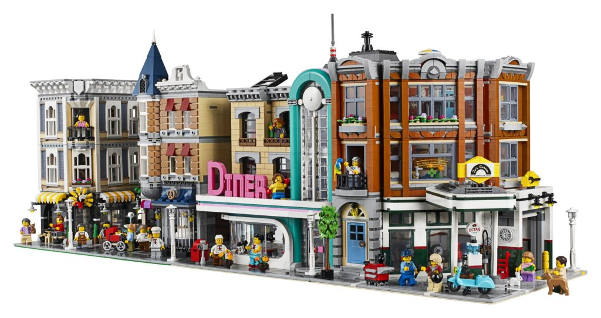

# Brickworld

A browser based procedurally generated world where your brick creations come alive.

The world is populated by minifigs going about their daily lives.

You can follow a minifig to see where they work, play, eat, and live.

There is a world of creations that you can explore

[Authoring Parts](dev/parts/README.md)

[Authoring Models](dev/models/README.md)

[Authoring Worlds](dev/worlds)

[test](example ":ignore")
[blockchain](dev/blockchain.md)
