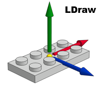
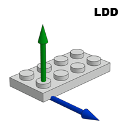
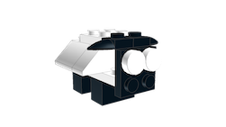
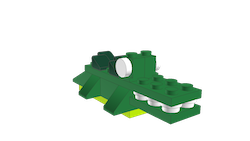

# Authoring Parts

Parts are authored manually. A part consists of a layers of meshes.

- High LOD - A detailed view of the part. Studs, tubes, etc, can have a varying LOD based on the performance of the machine.
- Low LOD - The simplest way to represent a part so it kinda looks right from a
  distance.
- Connectors - These contains all the information the system needs to know how to
  connect different legos together
  - Studs
  - Tubes
  - Edges

### Dimensions

BrickWorld uses [LDRAW](https://www.ldraw.org/article/218.html) dimensions to define bricks.


### Coordinate System

BrickWorld uses the same orgin as lego digital designer (LDD) for parts.
LDD parts have an orgin centered on the floor of the lower right stud.

 

### Model

The model should be the basic shape of a part. Studs? Tubes?

### Connectors

- [JBrickBuilder LDraw forum](https://forums.ldraw.org/thread-15255.html)
- [LDCad Snap](http://www.melkert.net/LDCad/tech/meta)

### Level of Detail

Part authors need to create a low polygon model of a part. The default model is simply a colored box that match the maximum dimensions of a part. In order for BrickWorld to render as many chunks as possible, it is necessary to have two representations. One representation is the high fidelity model that a user will see if they are up close. A second low-poly model is necessary to render in chunks that are far away.

### References

- [Studs with Logos](https://wiki.ldraw.org/wiki/Studs_with_Logos)
- [LDraw studs](https://www.ldraw.org/library/primref/#stud)

# Authoring Models

Models are meant to be imported into BrickWorld and used as is. Models can be treatd like a single part in a scene. This allows the rendering sytem to use an optimized model (hidden surface removals). It will allow us to display detailed legos up close but then use a low-polygon version for far off.

### CAD Software

- [LeoCAD](https://www.leocad.org/)
- [Lego Digital Designer](https://www.lego.com/en-us/ldd)
- [Bricklink Studio](https://www.bricklink.com/v3/studio/download.page)
- [List of Others](https://www.eurobricks.com/forum/index.php?/forums/topic/69726-section-index/&tab=comments#comment-1285180)

### LDraw Models

[LDraw Forums](https://forums.ldraw.org/archive/index.php)

LDraw format models can be imported. If a model contains bricks that are unsupported, the model will fail to import. You can build your own lego models using Lego CAD software.

[authoring](authoring)

|               |               |               |
| :-----------------------------------------: | :-------------------------------------: | :---------------------------------------------: |
| [penguin.ldr](models/penguin.ldr ":ignore") | [sheep.ldr](models/sheep.ldr ":ignore") | [alligator.ldr](models/alligator.ldr ":ignore") |

### Cleaning LDraw File

LDraw models are exported with large floating point values. To simplify models, you can run them through a utility that cleans up the models by rounding them if the difference is less than some small epsilon.

```
$ cat docs/models/penguin.ldr

0 penguin
0 Author: LEGO Digital Designer 4.3
1 0 9.99999904632568359375 -7.99999904632568359375 10 0 0 -1 0 0.999999940395355224609375 0 1 0 0 3623.dat
...
```

```
$ ldrawclean docs/models/penguin.ldr

0 penguin
0 Author: LEGO Digital Designer 4.3
1 0 10 -8 10 0 0 -1 0 1 0 1 0 0 3623.dat
...
```

### Existing Models

- [Eurobricks](http://www.eurobricks.com/forum/index.php?showtopic=41226)
- [Eurobricks: Official Lego sets made in LDraw](https://www.eurobricks.com/forum/index.php?/forums/topic/48285-key-topic-official-lego-sets-made-in-ldraw/)
