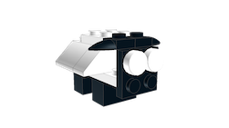
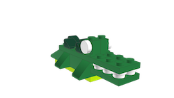
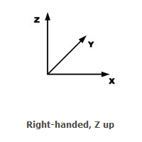

# Authoring Models

Models are meant to be imported into BrickWorld and used as is. Models can be treated like a single part in a scene. This allows the rendering sytem to use an optimized model (hidden surface removal).

## Examples

|               |               |               |
| :-------------------------------------------: | :---------------------------------------: | :-----------------------------------------------: |
| [penguin.ldr](examples/penguin.ldr ":ignore") | [sheep.ldr](examples/sheep.ldr ":ignore") | [alligator.ldr](examples/alligator.ldr ":ignore") |

## Coordinate System



Models are meant to be built part by part and so will use the same coordinate system as the world. Models use the right-handed z-up coordinate system. This is a different system than OpenGL and the parts coordinate system.

1 LDU = 1/64 in


### CAD Software

- [LeoCAD](https://www.leocad.org/)
- [Lego Digital Designer](https://www.lego.com/en-us/ldd)
- [Bricklink Studio](https://www.bricklink.com/v3/studio/download.page)
- [List of Others](https://www.eurobricks.com/forum/index.php?/forums/topic/69726-section-index/&tab=comments#comment-1285180)

### LDraw Models

[LDraw Forums](https://forums.ldraw.org/archive/index.php)

LDraw format models can be imported. If a model contains bricks that are unsupported, the model will fail to import. You can build your own lego models using Lego CAD software.

### Cleaning LDraw File

LDraw models are exported with large floating point values. To simplify models, you can run them through a utility that cleans up the models by rounding them if the difference is less than some small epsilon.

```
$ cat docs/models/examples/penguin.ldr

0 penguin
0 Author: LEGO Digital Designer 4.3
1 0 9.99999904632568359375 -7.99999904632568359375 10 0 0 -1 0 0.999999940395355224609375 0 1 0 0 3623.dat
...
```

```
$ ldrawclean docs/models/examples/penguin.ldr

0 penguin
0 Author: LEGO Digital Designer 4.3
1 0 10 -8 10 0 0 -1 0 1 0 1 0 0 3623.dat
...
```

### Existing Models

- [Eurobricks](http://www.eurobricks.com/forum/index.php?showtopic=41226)
- [Eurobricks: Official Lego sets made in LDraw](https://www.eurobricks.com/forum/index.php?/forums/topic/48285-key-topic-official-lego-sets-made-in-ldraw/)
