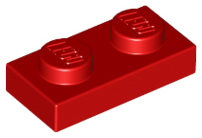
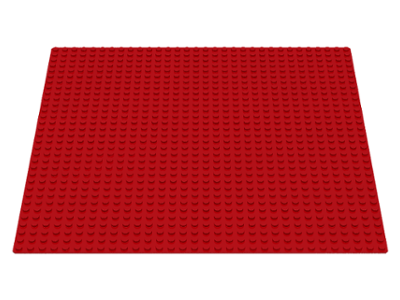
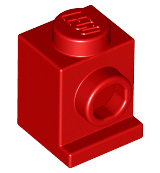
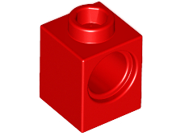
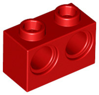
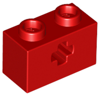
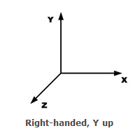
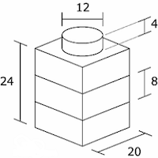
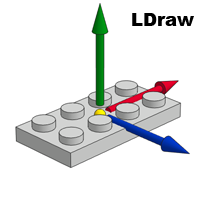
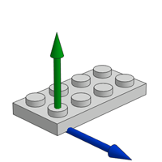

# Authoring Parts

This documentation will not really describe a space efficient means for transmitting data.

## Examples

[](dev/parts/examples/3005.json ":ignore")
[](dev/parts/examples/3811.json ":ignore")
[](dev/parts/examples/3001.json ":ignore")
[](dev/parts/examples/3004.json ":ignore")
[](dev/parts/examples/3811.json ":ignore")
[](dev/parts/examples/3811.json ":ignore")

## Coordinate System



Authoring parts uses the OpenGL coordinate system right-handed, y-up. Note: This is different than the model and world coordinate system of z-up.
Models and worlds use a z up because people are familiar with finding x,y on a graph paper.  Because opengl and most modeling systems use y up right handed rule, modeling parts does too.

1 LDU = 1/64 in

BrickWorld uses [LDRAW](https://www.ldraw.org/article/218.html) dimensions to define bricks.

BrickWorld uses the orgin centered on the floor of the lower right stud.






## LODs

The model should be the basic shape of a part.  Potential LODs

* Photo Realistic for POV ray
* High for up close geometry
* Low for in the distance geometry
* Studs - Stickers with logos, boxes, cylindars

## Snapping

To determine a valid fit, we check the bounding boxes (including studs) of the bricks. For each intersection we check the snap settings for matching snaps.

1) Provide ability for app to snap a brick in place.
2) Determine if a brick is a valid connection. This would be used in a dynamic situation where you had a moving lego part.
3) Provide optional geometry to display

Examples:

* [Brick](parts-brick.md)
* [Technic Brick](parts-technic.md)
* [Headlight Brick](parts-headlight.md)


### Snap Example: Traditional Stud
```javascript
// stud+
{
  "name": "stud+",
  "peg": true,             // false is a hole
  "slide": false,          //
  "type": "cylinder",      // cylinder, clip, fingers, generic
  "shapes": [
    {
      "shape": "round",    // round, square, axle
      "radius": 6,         // LDUs
      "length": 4,         // LDUs
    }
  ],
  "geometry": [...]        // The geometry to display for this snap (stud)
}

// stud-
{
  "name": "stud-",
  "peg": true,             // false is a hole
  "type": "cylinder", // clip, fingers, generic
  "shapes": [
    {
      "shape": "round",    // round, square, axle
      "radius": 6,         // LDUs
      "length": 4,         // LDUs
    }
  ]
}
```


* `peg`

  true - the peg part

  false - the hole part

* `geometry`

  If the snap part has geometry, we may or may not render it depending on the LOD needed

* `slide`

  Indicates if this cylinder shape should be considered 'smooth' enough to make sliding of matching parts possible. If ether part of a matched pair of snap info metas has the slide option set to true the user will be able to slide them together. If not it will just 'snap'.

  Be careful while setting this option as it can cause unwanted sliding of e.g. a stud inside an anti stud. In practice it is best to limit the slide=true value to things you know will slide most of the time (e.g. clips, bush and gear parts etc).

* `variant`

  Example: The standard stud would be type=Round, radius=

  - type - Round, Axle, Square
  - radius - radius of the peg
  - length - length of the peg


## Level of Detail

Part authors need to create a low polygon model of a part. The default model is simply a colored box that match the maximum dimensions of a part. In order for BrickWorld to render as many chunks as possible, it is necessary to have two representations. One representation is the high fidelity model that a user will see if they are up close. A second low-poly model is necessary to render in chunks that are far away.

## Example


```javascript
{
  "id": "3005",
  "tags": ["brick"],
  "name": "Brick 1 x 1",
  "geometry": {
    "positions": [20,24,40,20,0,40,20,24,-40,...],
    "normals": [1,0,0,1,0,0,1,0,0,...]
  },
  "snaps": [
    // These studs would allow this brick to stack on top of itself
    { "type": "stud-",
      "position": [0,0,0],
      "orientation": [1,0,0, 0,1,0, 0,0,1] }, // Rotation matrix (identity matrix if falsy)
    { "type": "stud+",
      "position": [0,24,0],
  ]
}
```


## References

- [Studs with Logos](https://wiki.ldraw.org/wiki/Studs_with_Logos)
- [LDraw studs](https://www.ldraw.org/library/primref/#stud)
- [Snapping: JBrickBuilder LDraw forum](https://forums.ldraw.org/thread-15255.html),
- [Snapping: LDCad](http://www.melkert.net/LDCad/tech/meta)
