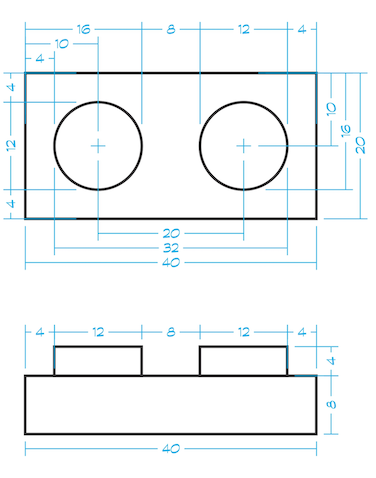

# Example: Brick




## `Part`

```javascript
{
  "id": "3023",
  "tags": ["plate"],
  "name": "Plate 1 x 2",
  "geometry": {
    "positions": [20,8,40, 20,0,40, 20,8,-40,...],
    "normals": [1,0,0, 1,0,0, 1,0,0,...]
  },
  "snaps": [
    { "type": "stud+", "position": [0,24,0] },
    { "type": "stud+", "position": [0,24,20] },
    { "type": "stud-", "position": [0,0,0] },
    { "type": "stud-", "position": [0,0,-20] },
  ]
}
```

## `Snaps`

```javascript
// stud+
{
  "name": "stud+",
  "peg": true,             // false is a hole
  "slide": false,          //
  "type": "cylinder",      // cylinder, clip, fingers, generic
  "shapes": [
    {
      "shape": "round",    // round, square, axle
      "radius": 6,         // LDUs
      "length": 4,         // LDUs
    }
  ],
  "geometry": [...]        // The geometry to display for this snap (stud)
}

// stud-
{
  "name": "stud-",
  "peg": true,             // false is a hole
  "slide": false,          //
  "type": "cylinder", // clip, fingers, generic
  "shapes": [
    {
      "shape": "round",    // round, square, axle
      "radius": 6,         // LDUs
      "length": 4,         // LDUs
    }
  ]
}
```
