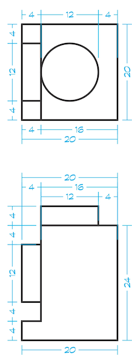

# Example: Headlight




## `Part`

```javascript
{
  "id": "3023",
  "tags": ["brick", "modified"],
  "name": "Brick, Modified 1 x 1 with Headlight",
  "geometry": {
    "positions": [20,24,20, 20,0,20, 20,24,0,...],
    "normals": [1,0,0, 1,0,0, 1,0,0,...]
  },
  "studs": [
    { "type": "stud+", "position": [0,24,0] },
    { "type": "stud+", "position": [0,24,0], "orientation": [???] }, //
  ]
  "snaps": [
    { "type": "stud-", "position": [0,0,0] },
  ]
}
```

## `Studs`

Optionally rendered studs that define connection points to bricks.

## `Snaps`

```javascript
// stud+
{
  "name": "stud+",
  "peg": true,             // false is a hole
  "slide": false,          //
  "type": "cylinder",      // cylinder, clip, fingers, generic
  "shapes": [
    {
      "shape": "round",    // round, square, axle
      "radius": 6,         // LDUs
      "length": 4,         // LDUs
    }
  ],
  "geometry": [...]        // The geometry to display for this snap (stud)
}

// stud2+
{
  "name": "stud2+",
  "peg": true,             // false is a hole
  "slide": false,          //
  "type": "cylinder",      // cylinder, clip, fingers, generic
  "shapes": [
    {
      "shape": "round",    // round, square, axle
      "radius": 6,         // LDUs
      "length": 4,         // LDUs
    }
  ],
  "geometry": [...]        // The geometry to display for this snap (stud)
}

// stud-
{
  "name": "stud-",
  "peg": true,             // false is a hole
  "slide": false,          //
  "type": "cylinder", // clip, fingers, generic
  "shapes": [
    {
      "shape": "round",    // round, square, axle
      "radius": 6,         // LDUs
      "length": 4,         // LDUs
    }
  ]
}
```
