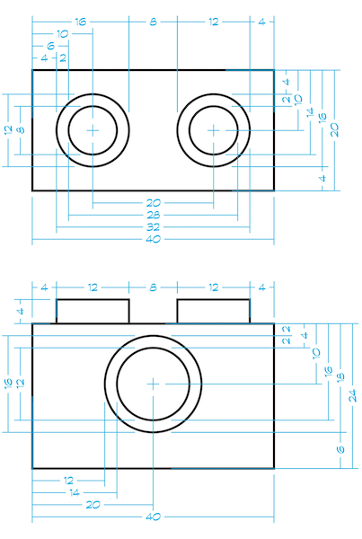

# Example: Technic Stud




```javascript
// technic stud
{
  "name": "technicstud-",
  "peg": false,
  "type": "cylinder", // clip, fingers, generic
  "slide": true,      //
  "shapes": [ // R 8 2 R 6 16 R 8 2
    {
      "shape": "round",
      "radius": 8,
      "length": 2,
    },
    {
      "shape": "round",
      "radius": 6,
      "length": 16,
    },
    {
      "shape": "round",
      "radius": 8,
      "length": 2,
    },
  ]
}
```
