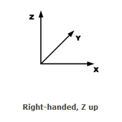

# Authoring Worlds

This documentation describes the space in-efficient format of a world.

## Coordinate System

Worlds use the right-handed z-up coordinate system. This is a different system than OpenGL and the parts coordinate system. This coordinate system was chosen because when locating points in the world, the typical means of doing that is through lat/long coordinates.  Brickworld is the same by allowing x,y coordinates which most people understand through graphing in grade school.

1 LDU = 1/64 in
